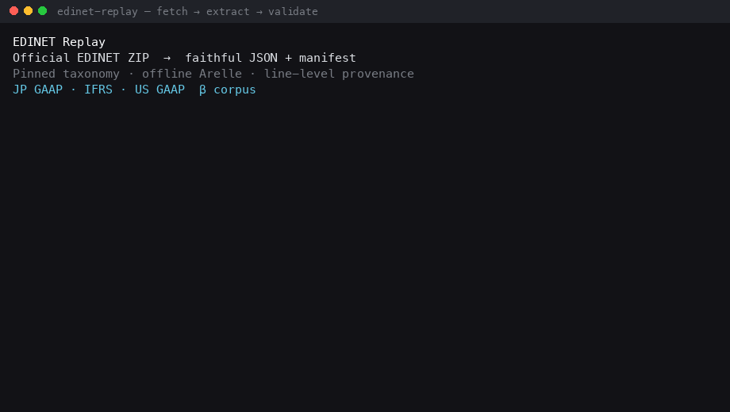

# EDINET Replay

**Official EDINET ZIP → verifiable faithful JSON + manifest.**  
Same source package, same pinned taxonomy, same Arelle version → same output hash.



> **Beta (`0.1.0b1`).** The vertical path `fetch → extract → validate` works for
> resolved XBRL. A multi-standard [β corpus](corpus/) (JP GAAP / IFRS / US GAAP)
> pins fixed docIDs and expected hashes. Inline XBRL presentation provenance is
> still incomplete. Best-effort, not production-certified.
> Not affiliated with Japan's FSA.

## 30-second demo

Corpus entry: **E04236 / S100W1NC** (JP GAAP annual report).  
Needs: Python 3.10+, `EDINET_API_KEY`, and the pin-matching FSA taxonomy zip
(see [`taxonomies/edinet-fsa-2024-11-01.json`](taxonomies/edinet-fsa-2024-11-01.json)).

```console
$ pip install -e ".[xbrl]"
$ export EDINET_API_KEY=…          # header only — never pass --api-key
$ edinet-replay fetch --document-id S100W1NC --store ./store
$ edinet-replay extract ./store/packages/S100W1NC/<raw_sha256>.zip \
    --taxonomy edinet-fsa-2024-11-01 -o ./out
$ edinet-replay validate filing  ./out/faithful-filing.json
$ edinet-replay validate manifest ./out/extraction-manifest.json
```

What you get:

| Output | Role |
|--------|------|
| `./out/faithful-filing.json` | Resolved facts (concept, value, context, unit, dims, nil, footnotes) |
| `./out/extraction-manifest.json` | Reproduction identity: dual package hashes, taxonomy pin, engine, selection |
| each fact's `source.package_path` + `source.line` | Pointer back into the official ZIP |

`fetch` writes an immutable `<raw_sha256>.acquisition.json` sidecar beside the ZIP.
It binds the package hashes to the real EDINET retrieval time, API version, and
explicit document-selection record; `extract` loads it automatically. For a ZIP
obtained outside `fetch`, pass a verified `--retrieved-at` value or an explicit
`--acquisition-record`. Extraction time is never substituted for retrieval time.

Example fact from this filing (value is a **string**, as reported):

```json
{
  "value": "4122148000000",
  "decimals": "-6",
  "dimensions": {
    "concept": "jppfs_cor:Assets",
    "unit": { "numerator": ["iso4217:JPY"], "denominator": [] }
  },
  "source": {
    "package_path": "XBRL/PublicDoc/jpcrp030000-asr-001_E04236-000_2025-03-31_01_2025-06-23.xbrl",
    "line": 4943
  }
}
```

…which is this line inside the source package:

```xml
<jppfs_cor:Assets contextRef="Prior1YearInstant" decimals="-6"
                  unitRef="JPY">4122148000000</jppfs_cor:Assets>
```

Expected canonical hash for the full filing: see
[`tests/golden/E04236-S100W1NC.json`](tests/golden/E04236-S100W1NC.json)
(`canonical_output_sha256`). Same path for IFRS and US GAAP entries in the
[β corpus catalog](corpus/beta-v1/catalog.json).

## Who this is for

Data engineers, quantitative researchers, XBRL implementers, ESG data users,
academic researchers, financial data providers, and institutional data teams who
need **verifiable** access to Japanese corporate disclosures — not a retail
stock screen.

## Why it exists

EDINET filings are public, but reproducible use is hard: XBRL/iXBRL structure,
taxonomy churn, lost context/units/dimensions/provenance, and opaque transforms
in normalized databases.

EDINET Replay focuses on **faithful reproduction, not financial interpretation.**
Mapping, normalization, comparability, and investment analysis are **Layer 2**
(out of scope here).

## What ships today

- CLI: `fetch` · `extract` · `validate` · `inspect`
- Offline Arelle resolution against **hash-pinned** FSA taxonomies
- Versioned JSON Schemas (`extraction-manifest` / `faithful-filing` 1.0.0)
- Content hashing + canonical JSON profile (golden-by-hash)
- β corpus v1 — one JP GAAP, one IFRS, one US GAAP annual report ([`corpus/`](corpus/))

### Other CLI shapes

```console
$ edinet-replay fetch --date 2025-06-27 --edinet-code E04236 --list-only
$ edinet-replay fetch --date 2025-06-27 --edinet-code E04236 \
    --select latest-original-filing --store ./store
$ edinet-replay inspect ./store/packages/S100W1NC/<raw_sha256>.zip
```

Selection is never implicit: with `--date` you pass `--list-only` or a named
`--select`. The API key is read only from `EDINET_API_KEY`.

### Library retrieval

```python
from edinet_replay.client import EdinetClient

client = EdinetClient()  # EDINET_API_KEY → Ocp-Apim-Subscription-Key header
listing = client.list_documents("2025-06-27")
download = client.download_document("S100W1NC")
# download.content is the submission ZIP exactly as received
```

## What this project does not do

- Merge XBRL concepts into a “common” economic concept  
- Normalize or assert economic meaning  
- Guarantee cross-company / cross-period / cross-GAAP comparability  
- Investment recommendations  
- Speak for the FSA / EDINET  

## Design in one line

**Layer 1 (this repo):** retrieval, package identity, offline DTS, faithful facts + provenance.  
**Layer 2 (elsewhere):** interpretation. Downstream tools should be auditable *against* Layer 1.

Reproduction identity = source content hash + taxonomy content hash + Arelle
version + extractor version + schema version + explicit selection record.  
Details: [architecture](docs/architecture.md) · [reproducibility](docs/reproducibility.md) · [schema](docs/schema.md).

## Engine

XBRL semantics via [Arelle](https://arelle.org/) (Apache-2.0). We do not reimplement
context / dimension / unit / accuracy resolution.

## Docs

- [β corpus](corpus/) · [For researchers](docs/for-researchers.md) · [For investors / data teams](docs/for-investors.md)
- [Japanese market data notes](docs/japanese-market-data.md) · 日本語: [README.ja.md](README.ja.md)

## Maintenance · License · Citation

Best-effort beta; no SLA on issues/PRs. Security: [SECURITY.md](SECURITY.md).  
Contributing: [CONTRIBUTING.md](CONTRIBUTING.md).  
Apache-2.0 — [LICENSE](LICENSE). Cite via [CITATION.cff](CITATION.cff).

Regenerate the demo GIF: `python tools/render_demo_gif.py` (Pillow).
